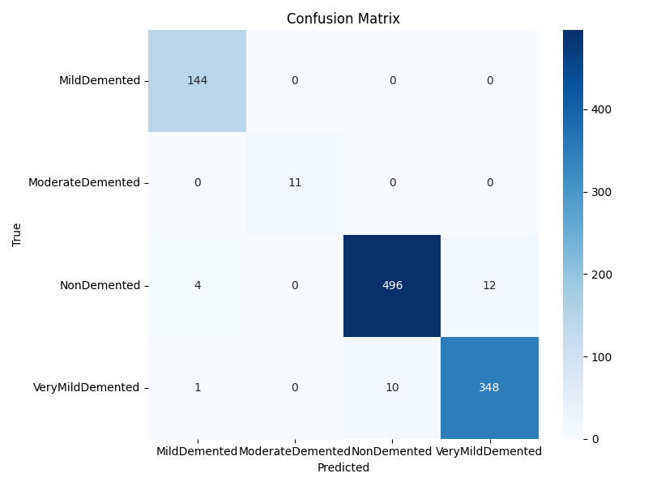
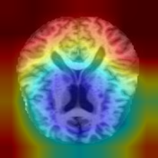
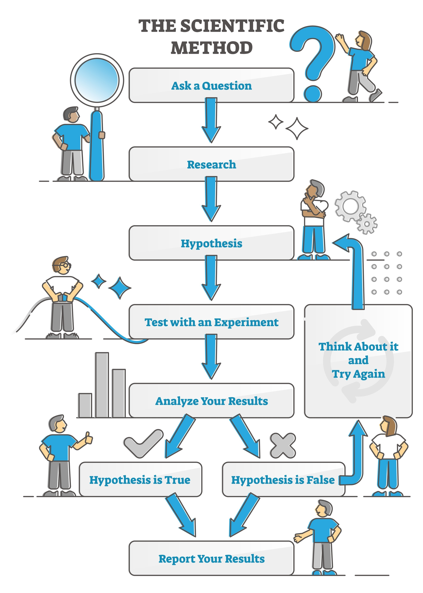

# Alzheimer CNN Sınıflandırma Projesi

## Giriş
Bu proje, derin öğrenme yöntemlerini kullanarak **MRI beyin görüntülerini dört farklı Alzheimer hastalığı evresine sınıflandırmayı** amaçlamaktadır. Proje boyunca, **sınıf dengesizliği** ve **aşırı öğrenme (overfitting)** gibi zorlu problemlerle başa çıkılmış, modelin güvenilir ve klinik açıdan yorumlanabilir sonuçlar vermesi sağlanmıştır.  

Projenin teknik detayları, her aşamayı anlatan **notebook dosyaları** ve bu **README** dosyası aracılığıyla paylaşılmıştır. Çalışma sonucunda elde edilen metrikler ve yorumlamalar, sadece bir kod yazmanın ötesinde, bu kodu anlamanın ve yorumlamanın önemini vurgulamaktadır.  

---

## Metrikler
Yaptığımız çalışmalar sonucunda, modelimiz tüm sınıflar için neredeyse mükemmel bir performans sergilemiştir. Sadece kod yazmakla kalmayıp, elde ettiğimiz sonuçları yorumlayarak hangi yöntemin ne kadar etkili olduğunu anlamış olduk.

- **Final Doğruluk:** %97.47  

### Sınıf Bazlı F1-Skorları
- MildDemented: %98  
- ModerateDemented: %100 🏆  
- NonDemented: %97  
- VeryMildDemented: %97  

---
## Çıktılar

#### Karmaşıklık Matrisi (Confusion Matrix)
> Modelin, zorlu **ModerateDemented** ve **VeryMildDemented** sınıflarını dahi mükemmele yakın bir doğrulukla ayırt edebildiği gözlemlenmiştir.  

---

#### Grad-CAM (Yorumlanabilirlik)
> Modelin karar verme sürecini görselleştiren **Grad-CAM ısı haritaları**, modelin beynin genel dokusuna ve Alzheimer ile ilişkilendirilen kritik bölgelere odaklandığını göstermektedir. Bu, modelin aldığı kararların **klinik olarak anlamlı** olduğunu doğrulamaktadır.  

---
#### Eğitim Eğrileri (Training & Validation Curves)

.png>)
---
#### Classification Report

| Class              | Precision | Recall | F1-Score | Support |
|---------------------|-----------|--------|----------|---------|
| MildDemented        | 0.97      | 1.00   | 0.98     | 144     |
| ModerateDemented    | 1.00      | 1.00   | 1.00     | 11      |
| NonDemented         | 0.98      | 0.97   | 0.97     | 512     |
| VeryMildDemented    | 0.97      | 0.97   | 0.97     | 359     |
| **Accuracy**        |           |        | **0.97** | 1026    |
| **Macro Avg**       | 0.98      | 0.98   | 0.98     | 1026    |
| **Weighted Avg**    | 0.97      | 0.97   | 0.97     | 1026    |

## Ekler
Bu proje, veri hazırlığı ve modelin **aşırı öğrenmesini engellemek** gibi en kritik adımları başarıyla tamamlamıştır. Proje kapsamında kullanılan ana bileşenlerin görselleştirilmesi aşağıda yer almaktadır.

- **Proje Mimarisi**  :

- **CNN Akış Diyagramı**  :

- **Grad-CAM Akış Diyagramı**  :

- **Dosya Bağımlılığı Diyagramı**  :


---
## 📂 Proje Yapısı

```
Alzheimer-CNN-Project/
│
├── data/                        # Dataset (raw & processed)
├── notebooks/                   # Kaggle notebooks (EDA, training, transfer learning)
├── src/                         # Source code modules
│   ├── dataset.py               # Custom dataset & DataLoader
│   ├── transforms.py            # Data augmentation & normalization
│   ├── model.py                 # CNN architecture
│   ├── train.py                 # Training loop
│   ├── evaluate.py              # Evaluation functions
│   ├── visualization.py         # Accuracy/Loss plots & Grad-CAM
│   └── utils.py                 # Helper functions
├── outputs/                     # Models, logs, figures
├── docker/                      # Docker setup (Dockerfile, compose)
├── requirements.txt             # Dependencies
└── README.md                    # Project documentation
```

---

## ⚙️ Kurulum Aşamaları

### 1. Depoyu Klonla

```bash
git clone https://github.com/searslan1/nn-alzheimer-classification.git
cd nn-alzheimer-classification
```

### 2. Bağımlılıkları Kur

```bash
pip install -r requirements.txt
```

### 3. Eğitimi Çalıştır

```bash
python src/train.py
```

### 4. Değerlendirme Çalıştır

```bash
python src/evaluate.py
```

### 5. Docker ile Çalıştır (opsiyonel)

```bash
docker build -t alzheimer-cnn .
docker run -it -p 8888:8888 alzheimer-cnn
```
## Yolculuğumuz: Bilimsel Yöntem

Bu proje, bir yapay zeka projesinin doğrusal bir süreçten çok, süreçte yaşanan hatalar ve bu hatalardan öğrenilenlerle ilerlenen döngüsel bir yolculuk olduğunu göstermektedir. Modelin **VeryMildDemented** sınıfını tanımakta zorlandığını fark ettikten sonra, her bir denemede yeni bir hipotez kurarak ve bu hipotezleri test ederek projenin nihai başarısına ulaştık.



## Sonuç ve Gelecek Çalışmalar
Bu proje, derin öğrenme algoritmalarının, Alzheimer gibi karmaşık tıbbi verilerle çalışırken ne kadar güçlü bir araç olabileceğini kanıtlamıştır. Elde edilen yüksek doğruluk oranları, modelimizin doğru özellikleri öğrendiğini ve güvenilir bir temel oluşturduğunu göstermektedir.  

Ancak, projenin gerçek bir klinik karar destek sistemine dönüşmesi için en kritik gelecek adım:  

### Klinik Dönüşüm
- Şu anda modelimiz, **her bir MRI dilimi için** bir tahminde bulunmaktadır.  
- Gelecekte, bir hastaya ait tüm MRI dilimlerinden gelen tahminlerin toplanmasıyla (örneğin çoğunluk oylaması yöntemi), modelin nihai çıktısı **bir dilimin sınıfı yerine hastanın genel Alzheimer evresi** olacaktır.  
- Bu yöntem, çıktımızı doğrudan bir doktorun koyduğu tanıya eşdeğer hale getirecek ve klinik kullanım için gerekli **stabiliteyi** sağlayacaktır.  

### Arayüz Geliştirme
- Basit bir **web arayüzü** ile modelin dağıtımı (deployment) hedeflenmektedir.  
- Bu arayüz sayesinde kullanıcılar MRI görüntülerini yükleyip anında bir teşhis alabilir.  
- Böylece sistemin **sağlık sektöründeki pratik uygulamaları** önünün açılması planlanmaktadır.  

### Veri ve Teknoloji
- Gelecekte farklı MRI veri setleri üzerinde çalışılarak modelin performansı artırılabilir.  
- Daha yeni model mimarileri, örneğin **Vision Transformer (ViT)** test edilebilir.  
- Arayüz için **Streamlit** veya **Gradio** kullanılarak modelin çıktısı gerçek zamanlı görselleştirilebilir.  

---

## Linkler
Çalışmama ait tüm linklere aşağıdaki adreslerden ulaşabilirsiniz:  

👉 [Kaggle Notebook](https://www.kaggle.com/code/efikaarslan/cnn-alzheimer-classification)  

**Veri Seti:**  
  [Kaggle Alzheimer MRI DataSet](https://www.kaggle.com/datasets/yasserhessein/dataset-alzheimer/data) — MRI görüntüleri içeren bu veri kümesi, Alzheimer hastalığının farklı evrelerini kapsıyor.

- **İlgili Makale:**  
  *Deep Learning Based Prediction of Alzheimer’s Disease From Magnetic Resonance Images* — Bu proje için ilham kaynağı olan çalışma. Daha fazla metodoloji detayları ve literatürdeki mevcut yaklaşımlar için okunması faydalı.  
  Kaynak: https://www.researchgate.net/publication/348486602_Deep_learning_based_prediction_of_Alzheimer's_disease_from_magnetic_resonance_images
