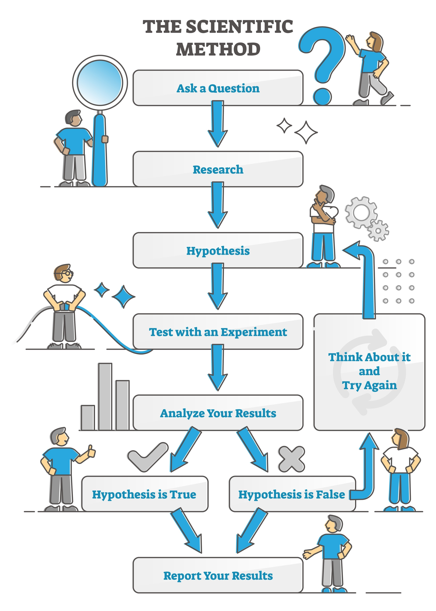

# 🧠 Alzheimer CNN Classification Project

## 📌 Project Overview

This project applies **Convolutional Neural Networks (CNNs)** using **PyTorch** to classify MRI brain images into different stages of **Alzheimer’s disease progression**. The aim is to develop a model that can support early detection and staging of Alzheimer’s using deep learning techniques, while also demonstrating explainability with **Grad-CAM**.

---

## 🎯 Objectives

* Train a CNN model on MRI images from the Alzheimer dataset.
* Perform multi-class classification into 4 categories:

  * **Non Demented**
  * **Very Mild Demented**
  * **Mild Demented**
  * **Moderate Demented**
* Implement preprocessing, augmentation, dropout, and evaluation metrics to ensure robustness.
* Visualize model performance with:

  * Accuracy/Loss curves
  * Confusion matrix & classification report
  * Grad-CAM heatmaps for interpretability

---

## 🛠️ Framing

* **Input:** MRI Brain Image → resized, normalized, augmented.
* **Layers:**

  * Convolution + ReLU (feature extraction)
  * MaxPooling (dimensionality reduction)
  * Dropout (regularization)
  * Flatten (vectorization)
  * Dense Layer (fully connected)
  * Output Layer (Softmax)
* **Output:** Probability distribution across 4 Alzheimer stages.
* **Interpretation:** Predicts disease stage + highlights brain regions influencing the decision (Grad-CAM).

---

## 📂 Project Structure

```
Alzheimer-CNN-Project/
│
├── data/                        # Dataset (raw & processed)
├── notebooks/                   # Kaggle notebooks (EDA, training, transfer learning)
├── src/                         # Source code modules
│   ├── dataset.py               # Custom dataset & DataLoader
│   ├── transforms.py            # Data augmentation & normalization
│   ├── model.py                 # CNN architecture
│   ├── train.py                 # Training loop
│   ├── evaluate.py              # Evaluation functions
│   ├── visualization.py         # Accuracy/Loss plots & Grad-CAM
│   └── utils.py                 # Helper functions
├── outputs/                     # Models, logs, figures
├── docker/                      # Docker setup (Dockerfile, compose)
├── requirements.txt             # Dependencies
└── README.md                    # Project documentation
```

---

## ⚙️ Setup Instructions

### 1. Clone the Repository

```bash
git clone https://github.com/<username>/Alzheimer-CNN-Project.git
cd Alzheimer-CNN-Project
```

### 2. Install Dependencies

```bash
pip install -r requirements.txt
```

### 3. Run Training

```bash
python src/train.py
```

### 4. Run Evaluation

```bash
python src/evaluate.py
```

### 5. Run with Docker (optional)

```bash
docker build -t alzheimer-cnn .
docker run -it -p 8888:8888 alzheimer-cnn
```

---

## 📊 Results & Evaluation

* **Metrics:** Accuracy, Loss, Precision, Recall, F1-score.
* **Visualizations:**

  * Accuracy & Loss curves (epoch-wise)
  * Confusion matrix
  * Classification report
  * Grad-CAM heatmaps highlighting brain regions

---

## 🔎 CNN Pipeline Diagram


---

## 🔎 Grad-CAM Pipeline Diagram


---

## 🚀 Extensions & Bonus

* **Transfer Learning:** Use pre-trained models (ResNet, EfficientNet).
* **Hyperparameter Optimization:** Tune learning rate, batch size, dropout.
* **Explainability:** Grad-CAM ensures model interpretability in medical context.

---

## 📎 Dataset Reference

* Kaggle: [Alzheimer MRI Dataset](https://www.kaggle.com/yasserhessein/dataset-alzheimer)
* Paper: [Deep learning based prediction of Alzheimer’s disease from MRI](https://www.researchgate.net/publication/348486602_Deep_learning_based_prediction_of_Alzheimer's_disease_from_magnetic_resonance_images)

---

## 👤 Author

* **Your Name**
  Akbank Bootcamp Project – CNN Deep Learning (Alzheimer MRI Classification)

---

## 📜 License

This project is licensed under the MIT License.
